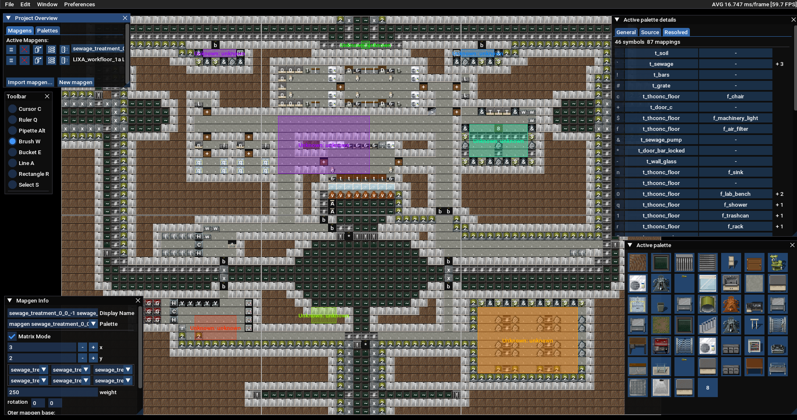

# Mapgen Editor Tool

Map making & editing tool for [Cataclysm: Dark Days Ahead](https://github.com/CleverRaven/Cataclysm-DDA).

## How to install
See [INSTALL.md](doc/BNMT/INSTALL.md)

## How to compile
See [COMPILING.md](doc/BNMT/COMPILING.md)

## How to use
(Outdated) See [TUTORIAL.md](doc/BNMT/TUTORIAL.md)

(Outdated) Video example: https://www.youtube.com/watch?v=V4d-4qh2-nQ

## Features
List of currently implemented features.

As this is a WIP tool, some of the functionality may be bugged, half-implemented or partially disabled.
Such functionality is marked with (*).

- Create, save and load projects
- Create and edit new mapgens and palettes
- *Import existing palettes and mapgens
- Draw symbols with mouse
   - Brush (hold mouse button to draw)
   - Pipette (pick tile from canvas)
   - Line drawing tool
   - Rectangle tool
   - Bucket tool (flood fill, global fill, fill in selection)
   - Ruler tool (measure distance and area)
- Copy/cut/paste tiles, paste symbols from OS clipboard
- Undo/redo support
- Work on multiple mapgens at once
- Work with multiple palettes at once
- Automatic resolution of palette inheritance
- *Configurable resolution for parametric palettes
- Autocomplete, fuzzy search and validation for identifiers
- *UI retains its state between sessions
- Configurable autosaves
- Supports editing nested and update mapgens
- Supports editing big oter mapgens (e.g. 48x48, 72x96 - any multiple of 24)
- Export palettes and mapgens into JSON
- Automatic JSON formatting on export
- *Assign different mappings to symbols (terrain/furniture/items/fields/graffiti/vehicle/monster/NPC/other)
- *Mapgen objects (aka `place_*` functions, i.e. objects placed within an area)
- *QoL UI features (hotkeys, tooltips)
- Tooltip preview for symbol contents when editing
- Visual preview for terrain and furniture (including `t/f_region_*` preudo objects)
- Configurable display options (sprites, symbols, OMT boundaries)
- *Visual preview for vehicle and nested placement boundaries
- Loot Designer tool that provides a quick way to test various item spawn results
- *Mod support (edit default mod list to configure what data will be loaded)

## Bugs and limitations
See [TODO.md](doc/BNMT/TODO.md) for list of planned features.

See [BUGS.md](doc/BNMT/BUGS.md) for list of known bugs.

If you don't see your issue there, feel free to open a ticket or contact me on Discord.

## Feedback
General feedback is appreciated. Feel free to open an issue, or contact me on Discord. I'm available on various Cataclysm related servers, user id `olanti_p`.

## License
This tool is licensed under the Creative Commons Attribution-ShareAlike 3.0 Unported License.
