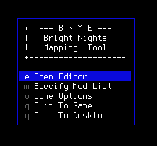
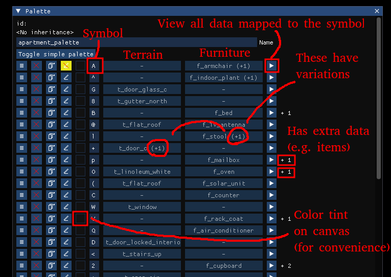
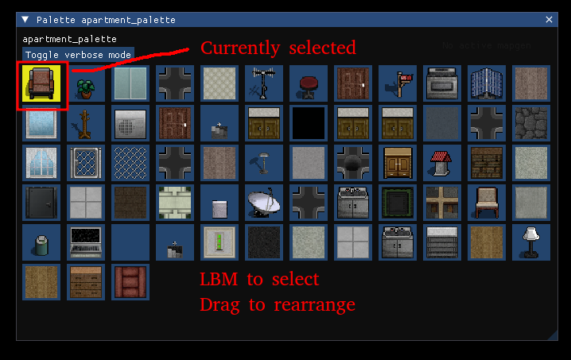
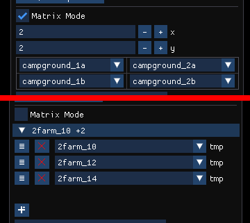
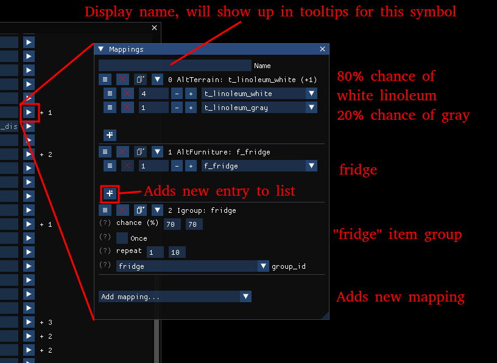
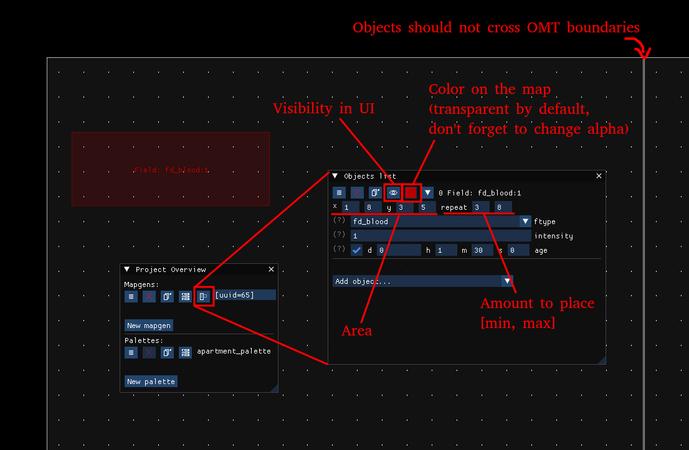
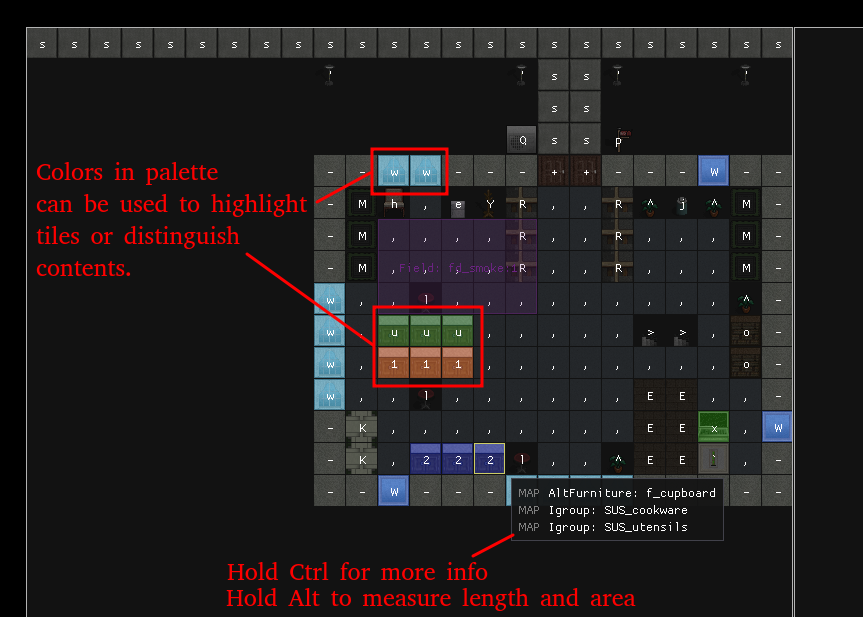

# Usage (short tutorial)

## Starting up

Launch `bnmt` executable. This is a modified game instance that should be roughly equivalent to vanilla executable,
except with additional code for the editor.

If installation has been done correctly, you should be met with the welcome screen:

Here, you can specify which mods the editor will load, open game settings menu or exit the editor and return to the base game.

Once you're done, select `Open editor`, wait for it to load game data, and in the new menu (now mouse controlled) click `New Project`.

## UI overview

You can hover mouse cursor over many UI elements to get tooltips explaining hotkeys or meaning of elements.

Grayed out question marks (?) also provide additional information.

Holding Ctrl will reveal additional information for tiles and objects on canvas.

Main menu bar at the top can be used to save/export current project, as well as control which windows are visible.

`Debug/Metrics` window can be used to check FPS.

## TODO parts

Some functionality is still work-in-progress, such as advanced mappings like the nested mapgen placement or some cases of error checking.

See `doc/BNMT/TODO.md` and `doc/BNMT/BUGS.md` for examples.

Usually wip functionality is marked with `TODO` in UI.

## Palette import

Since we're lazy, we'll be importing existing palette instead of creating our own.

Find `Project Overview` window, and click `New palette` button.

Select `Import` -> `apartment_palette` as Source, then `Confirm`.

There may be a warning about missing import functionality, but we don't care about it, just click the option to dismiss it if it pops up.

Now, the palette is available in the list of palettes in `Project Overview` window. If you click on it, you'll be greeted
with a long list that describes what symbols correspond to what data.

Clicking `Toggle simple palette` will reveal a simplified view that's more convenient for drawing.

In verbose view, you can inspect and modify all data associated with the symbols, as well as create new entries.

## Creating mapgen

The game supports a lot of mapgen variations, but we'll be exploring the most common one: plain oter mapgen represented as JSON grid of symbols.

In `Project Overview` window, click `New mapgen`, ensure `Oter` type is selected, then toggle OFF `Create new palette` and
in the drop-down list select our `apartment_palette`. You can optionally give the new mapgen a name. Once you're done, click `Confirm`.

You'll see the new mapgen on the list, and clicking on it will make it appear in the editor view.

You can pan the camera with RMB and zoom with the mouse wheel. More info on camera control can be found in `Camera Controls` window.

## Drawing with mouse

You may notice that the mapgen does not have a grid yet. Open `Mapgen Info` window, and near the bottom select `Rows`.

Switch to `Brush` tool in the `Toolbar` window, and click on any tile in the simplified palette view.

Now, you can paint on the resulting canvas with your mouse. The are other drawing tools available, see `Toolbar` window for more info.

## Undo, redo, save, export, autosave

The editor provides full undo/redo functionality using standard `Ctrl+Z`/`Ctrl+Shift+Z` hotkeys. See `History` window for more info.

The project can be saved for future work in the editor, or exported for use by the game,
with `Save`/`Export` options under `File` section in the main menu bar.

The editor periodically creates autosaves of the project and writes them into `config/autosave/<timestamp>.json`.
These can be used to recover lost work in case of crash, but should not be relied upon for normal saving.

## Configuring oter mapgen

Oter mapgen configuration can be done through the UI, or manually afterwards in the export file.

The main options you want to customize are:
1. `fill_ter` field. Simple defaults are `t_region_groundcover` for z=0, `t_open_air` for z>0, `t_rock` for z<0 
2. `Matrix Mode`. If you want a large mapgen, larger than 24x24, use matrix mode, set matrix size to needed
    size and specify which OMTs the mapgen corresponds to.
3. `Normal Mode`. Opposite of `Matrix Mode`, your mapgen will have a fixed 24x24 size, but it'll let you specify
    1 or more OMTs that it will correspond to.

When in Matrix Mode, you can toggle OMT grid display through `Preferences` menu in the main menu bar.

Note that in order for the editor to recognize your OMT input as valid id, the relevant OMTs should be present
in the data files during loading (either base game files or a mod added through welcome screen).

## Symbol mappings

Each symbol in the palette must be unique and may be associated with 0, 1, 2 or more data entries, aka `Mapping`s.

TODO: Not all mappings are currently implemented, but the main ones should work (terrain, furniture, items, graffiti/signs).

You can freely add or remove mappings to palette entries at any time.

The furniture and terrain is added with `AltFurniture` and `AltTerrain` mappings.
They contain weighted lists, which let you specify what terrain/furniture types will be placed and at what relative weight.

When you create a new palette entry with the `New Ter`/`New Furn`/`New Furn+Ter` buttons,
that's just a shortcut that creates a new symbol with `AltFurniture`/`AltTerrain` mapping that has 1 entry in its list.

Many mappings have complex data fields, though most of them should be explained via tooltips.

## Map objects

Map objects are pieces of data that can be randomly placed within an area.

The list of map objects can be accessed through the relevant button.

## Z-levels

The editor does not explicitly support z-levels, but you can create multiple mapgens (one for each z-level),
arrange them in the right order in `Project Overview` window and quickly scroll between them with mouse wheel while holding `Alt`.

Some other small tricks:

